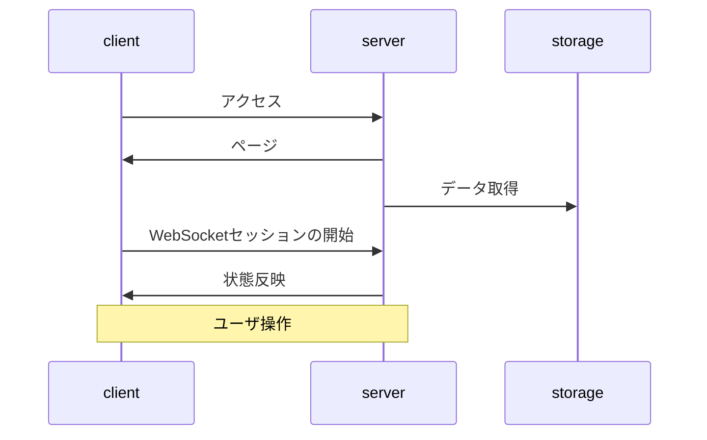
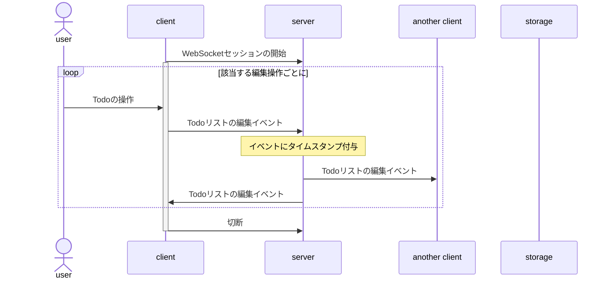
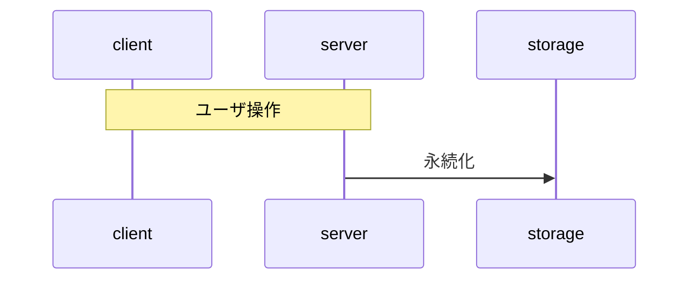
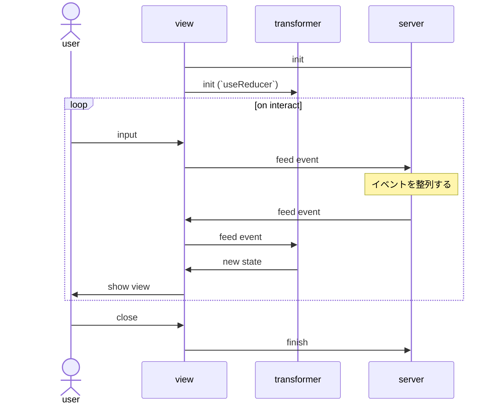
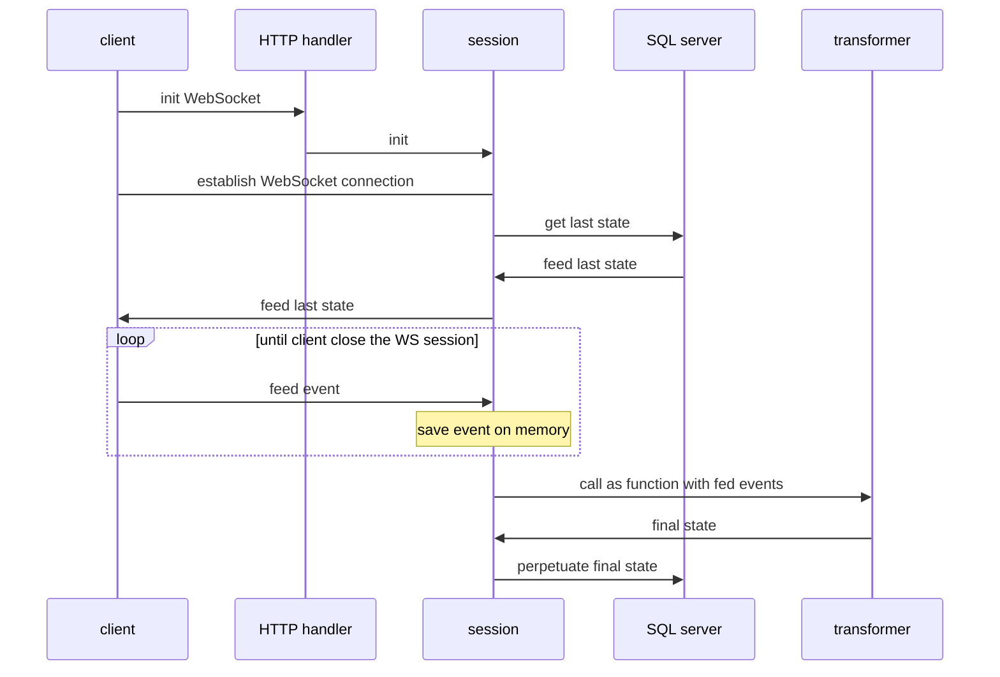

# todo app

> **Note**
> 人事面接などで見せられるものが欲しいので開発。
> どんな技術を使えるかや、その使い方を見せることが目的。
> このreadmeを含めて、独力で開発する。

ブログポスト: <https://naoyafurudono.github.io/posts/todo-app/>
実装した感想や、技術選定のモチベーションなど。

## 目次

- [todo app](#todo-app)
  - [目次](#目次)
  - [アプリの説明](#アプリの説明)
  - [実行フローの概要](#実行フローの概要)
    - [開始](#開始)
    - [ユーザ操作](#ユーザ操作)
    - [保存](#保存)
    - [懸念](#懸念)
      - [操作結果の整合性](#操作結果の整合性)
  - [使う技術](#使う技術)
  - [プログラムの設計](#プログラムの設計)
    - [クライアント](#クライアント)
    - [サーバ](#サーバ)
    - [JSON Format](#json-format)
      - [Todo 更新イベント (pub)](#todo-更新イベント-pub)
      - [Todo 更新イベント (sub)](#todo-更新イベント-sub)
  - [実装の工程管理](#実装の工程管理)
  - [参考文献](#参考文献)

## アプリの説明

- Todoアプリ
- Webアプリケーション
- Todoタスクの登録、削除、編集、保存、Todo/Doneの切り替えがGUIでできる
- マルチユーザで同時に編集可能

## 実行フローの概要

次の３つに分ける。

1. 開始
1. ユーザ操作
1. 永続化

> **Note**
> このセクションのフロー図は mermaidを使って書きました。
> <https://mermaid-js.github.io/mermaid/#/sequenceDiagram>

### 開始

サーバはページの送信、Todoデータの取得、クライアントへの反映を行う。
状態の反映はWebSocketを通じて行う。



### ユーザ操作

ユーザがアプリケーションを操作する場面。変更は随時サーバに同期する。
ここでは永続化はしないで、サーバのメモリに起きたイベントを保持する。



### 保存

セッションの終了時にサーバは永続化処理を行う。
永続化は２種類のデータについて行う：

- Todoの編集イベント
- Todoリストの現在の状態

現在の状態は「開始」で取得する前回の状態と、今回の編集イベントから計算する。



### 懸念

設計の懸念点を議論する。

#### 操作結果の整合性

- イベントをクライアントと、サーバのそれぞれで解釈する。実装のミスで解釈の結果が一致しないと、ユーザがクライアントを通して見ていた結果と異なるTodoリストの状態がストレージに保存される。
- 整合性を保証することが実装上の負荷になる。

対策としては、コードを共通化することが考えられる。
たとえばサーバとクライントを両方JSで書くことにして、状態遷移の実装や状態のエンコード/デコードはサーバ、クライアント間で共通のコードを用いれば良い。
サーバでJSを使いたくなければ、サーバのコードをJSにコンパイルして、それをクライアントで使う手もある。手間は掛かりそうだし、JSへのコンパイルに対応している言語に制限されはするが。

~~今回はGolangをサーバで使うことにしたので、[GopherJS](https://github.com/gopherjs/gopherjs)をコンパイラとして使うことにする。~~
よくよく調べてみたら、GopherJSはメイン関数を定義しないとコンパイルできないみたいだ。
結合が面倒になりそうなので、諦めてクライアントとバックエンドのそれぞれにイベント処理を書く。

## 使う技術

- クライアント: React with TypeScript, GopherJS
- サーバ: Golang
- サーバインフラ: Google App Engine, Google Cloud SQL
- その他
  - WebSocketによる通信

## プログラムの設計

### クライアント



`transformer` は ~~Goで実装してGopherJSでコンパイルしたものを必要に応じてラップして実装する。~~ TypeScriptでreducerとして普通に書く。

### サーバ

ページの配信は省略



### JSON Format

サーバ・クライアント間での通信に用いるJSONのフォーマットを定義する。

#### Todo 更新イベント (pub)

クライアント -> サーバ

これを `pub` とする

```javascript
{
  "operation": string,
  "payload": {
    "id": string,
    "statement": string
  }
}
```

`operation` は次のいずれか:

- `toggleDone`
- `updateStatement`
- `create`

`payload` に書ける内容は `operation` によって変わる。

`id` は常に必須で、
`updateStatement`, `create` が指定されたときは、`statement` が必須。

#### Todo 更新イベント (sub)

サーバ -> クライアント

```javascript
{
  "command": pub,
  "timestamp": string
}
```

`timestamp` は RFC3339 に則って、タイムゾーンはUTCとする
（例: `1985-04-12T23:20:50.52Z`）。

`command` には対応するクライアントからの更新イベントをそのまま渡す。

(`id` をサーバで付与したくなるかもしれないが、クライントで付与する。クライアントのTodoリストは、イベントに対して決定的であることが要求される。)

## 実装の工程管理

- [x] Transformer
- [x] View (リストをアップデートできる)  -- (ここまでで見た目は整う)
- [x] HTTP server += WebSocket (session のモック)
- [x] View += WebSocket
- [x] Viewでのイベント処理
- [x] サーバ・view間でのイベント連携
- [ ] SQL server
- [ ] HTTP server += SQL server
- [ ] Session += SQL connection
- [ ] Session += transformer
- [ ] sync state命令を実装する
  - 新しくセッションに参加したユーザのために、最新の状態を他の参加者に教えてほしい。そのための命令がsync state.

sync state: 自身の最終更新タイムスタンプを引数にして発行する。その時刻以降のタイムスタンプを持っているクライアントは、自身の状態をupdate state命令で全体に強制する。update stateを発行する際は状態に加えて、発行の直前のタイムスタンプを引数に加える。
update stateを実行すると、クライアントは自身の最終同期時刻をそのタイムスタンプ引数でアップデートする。もしupdate state命令のタイムスタンプが自身の最終更新時刻よりも古い場合、その命令は無視する。

## 参考文献

- [mermaid](https://mermaid-js.github.io/mermaid/#/sequenceDiagram?id=configuration): シーケンス図の書き方
- [GopherJS](https://github.com/gopherjs/gopherjs): Go -> JS コンパイラ。~~transformerのソースコードを共通化するために使用~~
  - やっぱり使わないことにした。
